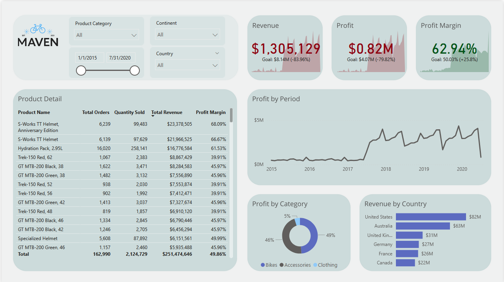

# Maven Cycles One-Pager – Power BI 🚴‍

A sleek, interactive one-page Power BI dashboard delivering a high-level overview of Maven Cycles’ global sales performance, profitability, and revenue distribution.

> ✅ **Built as part of the**  
> [Microsoft Power BI: PL-300 Certification Prep (Data Analyst)](https://www.udemy.com/course/microsoft-power-bi-certification-da-100-exam-prep/learn/)  
> Udemy course by Maven Analytics

> 🎨 Visual design and layout have been customized and enhanced for a cleaner, executive-ready look.

---

## 📊 Highlights
- **Revenue, Profit & Margin KPIs** with variance against goals
- **Profit by Period** (2015–2020): trend line showing performance over time
- **Profit by Category**: interactive donut chart for Bikes, Accessories, and Clothing
- **Revenue by Country**: bar chart of top geographic contributors
- **Product Detail Table**: sortable table showing product-wise orders, revenue, quantity sold, and profit margins

---

## ⚙️ Tools & Technologies
- **Power BI** – Report design and publishing  
- **Power Query** – Data loading, shaping, and cleansing  
- **DAX** – KPI measures and business logic (e.g., margin %, revenue goals, period trends)  
- **Dataset** – Provided in course; enhanced with custom styling and interactions

---

## 🎯 Filters & Interactivity
- Time range slicer (2015 to 2020)
- Continent and Country dropdowns
- Product Category filter

---

## 🔗 Live Report
[👉 View dashboard](https://app.powerbi.com/view?r=eyJrIjoiZDVmNmMxNDItMWVjNC00ZjYwLTlhYzEtNjMwOTcxMjdiYjU3IiwidCI6IjI3ZjExNTYzLTlhMDgtNDNiZC1hZDhmLTJlZGZiZTkxNmMzNCJ9)

---

## 🧩 My Role
- Followed course modules to construct the core data model and KPIs  
- Enhanced report design with improved layout, color consistency, and minimalist styling  
- Implemented advanced slicers and conditional formatting to support better storytelling  
- Ensured the report is self-contained and ready for executive or stakeholder presentation

# 🖼️ Overview Screenshot

