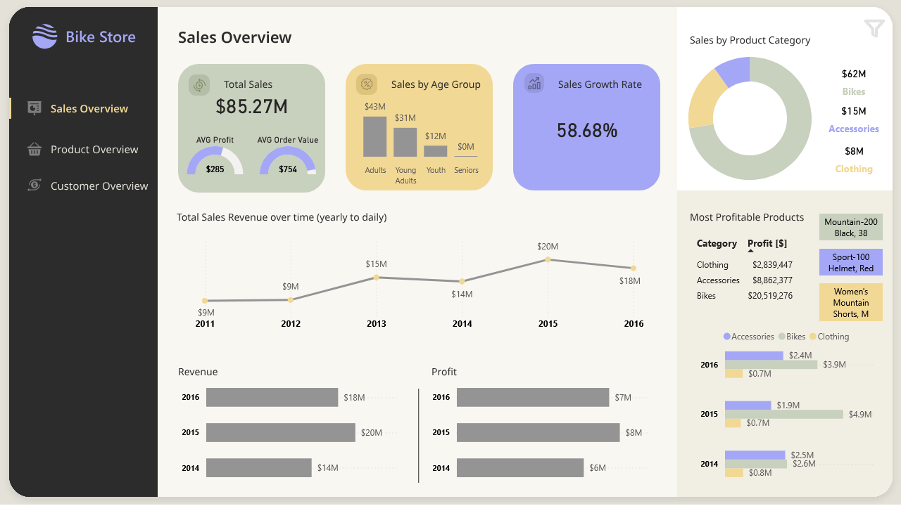

# Bike Store Sales Analysis – Power BI

A comprehensive Power BI report designed to analyze and visualize sales data for a bike store. This project started with the first page created during the Data Hero course and was extended independently to include additional analyses and dashboard pages.

> ✅ **Built as part of the**  
> [Data Heroes 2.0](https://dataheroes.pl/) course by Dagmara Anuszczyk.

## 🎯 Business Problem

The bike store management faces several key challenges addressed by this analysis:

- **Sales Performance Monitoring:**  
  📈 Track overall sales performance, identify trends and patterns over time, and analyze sales by product categories and sub-categories.

- **Product Analysis:**  
  🛒 Assess product category profitability, identify top-selling products, optimize inventory, and explore upselling opportunities.

- **Customer Analysis:**  
  👥 Understand sales patterns by region, identify high-potential markets, and gain insights into customer demographics and buying behavior to tailor marketing strategies.

## 🛠️ Approach and Solution

1. **Data Collection:**  
   📊 Sales data sourced from internal systems like POS and e-commerce platforms.

2. **Data Preparation:**  
   🧹 Data cleaning, type transformation, missing value handling, and aggregation using Power Query.

3. **Data Modeling:**  
   🧩 Creation of fact and dimension tables with relationships to support analysis.

4. **Calculated Measures:**  
   📐 Developed DAX measures to calculate KPIs for sales, products, and customers.

5. **Report Design:**  
   🎨 Designed an intuitive, interactive report with multiple pages: Landing Page, Sales Overview, Product Overview, Customer Overview, and Data Model.

## 🚀 Benefits and Insights

- Monitor sales revenue and trends to support data-driven decision making.  
- Optimize product mix and inventory based on profitability and sales performance.  
- Enhance customer understanding through demographic and regional sales analysis.

## ⚙️ Tools & Technologies

- Power BI, Power Query, DAX  
- Data Hero course foundation plus self-driven enhancements  
- Live report link: [View dashboard](https://app.powerbi.com/links/GDgaCe2SgY)

## 🧩 My Role

- Extended the initial course project with additional data modeling and analytics.  
- Created complex DAX measures and interactive visuals.  
- Designed user-friendly, multi-page dashboard focused on business insights.

## 🖼️ Screenshot

