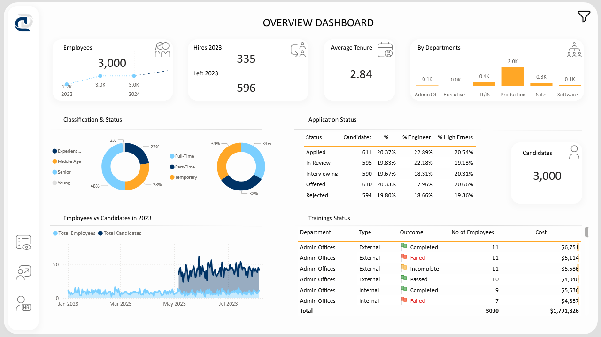

# Recruitment Funnel Dashboard – Power BI

An interactive Power BI dashboard designed to analyze key HR metrics such as headcount, turnover, and demographic trends. The project began with the overview page developed during the *Power BI dla Analityków* course by Dagmara Anuszczyk, and was further extended independently with additional pages and deeper analysis.

> ✅ **Built as part of the**  
> [Power BI dla Analityków](https://bideveloper.pl/pbifundamentals/) course by Dagmara Anuszczyk.

## 📊 Key Features:
- Overview of total employees, new hires, and terminations
- Net headcount growth over time
- Filtering by department, location, and employment category
- Breakdown of gender and age demographics
- Visual comparisons by region and business unit

## ⚙️ Tools & Technologies:
- Power BI, DAX, Power Query
- Simulated HR dataset
- Public dashboard link: [View report](https://app.powerbi.com/view?r=eyJrIjoiMDI0ZDM1MWUtMjE4Yi00NDEzLTgzNmUtM2U2ZTRkYmY5Y2NiIiwidCI6IjI3ZjExNTYzLTlhMDgtNDNiZC1hZDhmLTJlZGZiZTkxNmMzNCJ9)

## 🧩 My Contribution:
- Data cleaning and transformation in Power Query
- Data model design and relationships
- Building custom DAX KPIs and funnel metrics
- UX-focused report layout and interactivity

## 🖼️ Screenshot:

